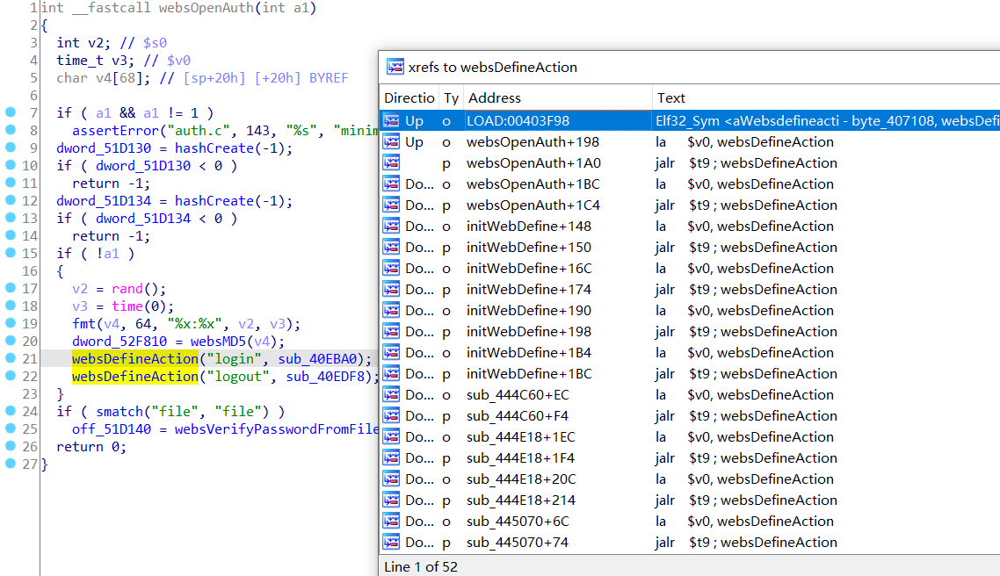
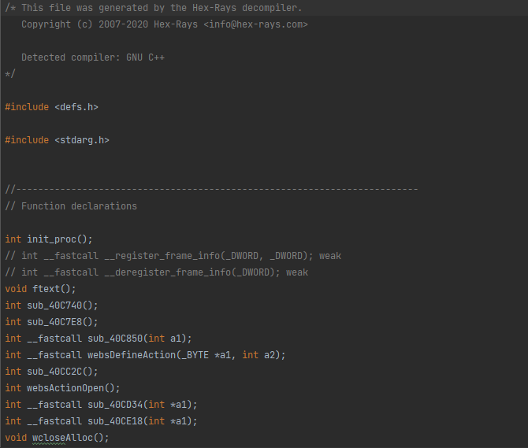
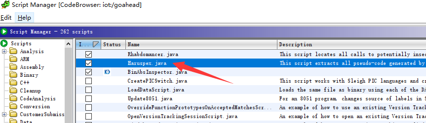

# 批量测试goahead接口

## **0x00**

一些嵌入式设备会采用goahead作为web服务器

在有实体设备或者模拟好环境的情况下，此脚本目的是为了在挖掘goahead为web服务器的嵌入式设备时，快速判断哪些接口是可未授权访问的，哪些接口是存在的，也可用于收集接口信息用于进一步分析

## **0x01**

在IDA逆向结果中，注册action接口的函数一般为websDefineAction()，也有可能是其他命名(需要简单分析一下)，一般可通过比较通用的几个接口如login、logout找到它，通过查看交叉引用可找到所有接口

生成伪代码，将接口名称筛选出来保存，写一个简单的脚本，用来提取接口名称,加上指定路径遍历访问接口，判断返回码确认是否可以未授权访问（也可以换上认证后的cookie）

## **0x02**

IDA中打开文件，File->Produce code->Create C file,可生成所有伪代码，

在Ghidra中，使用脚本Haruspex，地址为[ghidra-scripts/Haruspex.java at main · 0xdea/ghidra-scripts (github.com)](https://github.com/0xdea/ghidra-scripts/blob/main/Haruspex.java)，可将所有伪代码保存到一个文件夹下（每个函数生成一个C文件）

还有一个Ghidra python脚本，https://github.com/tenable/ghidra_tools/tree/main/extract_decomps

## **0x03**

运行时在extract_the_api.py修改分析出来的注册接口的函数，如websDefineAction，在batch_test_interface.py修改发包信息，如cookie，路径（/goform/、/cgi-bin/等），根据实际情况修改

结果会保存返回状态码为200的url和返回报文

建立在goahead注册接口比较规范的情况下

