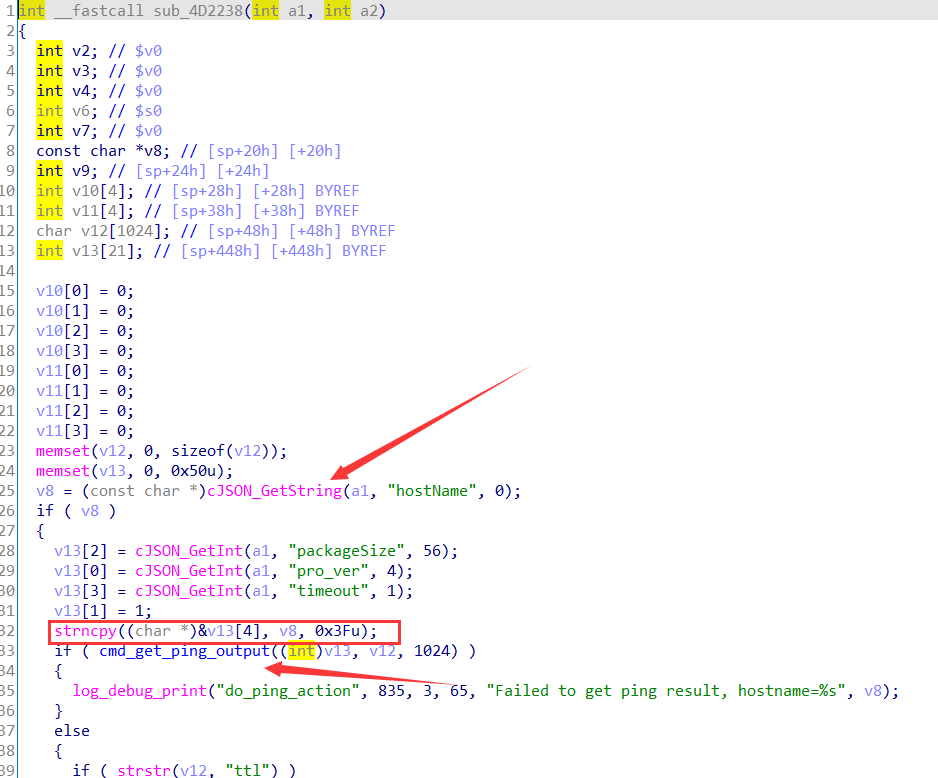
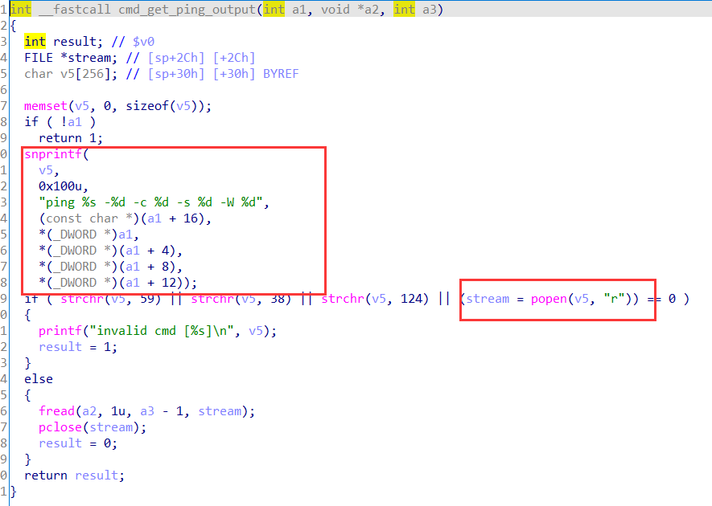
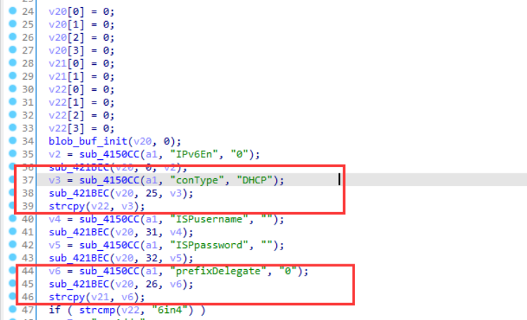
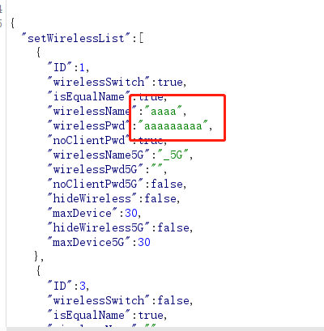
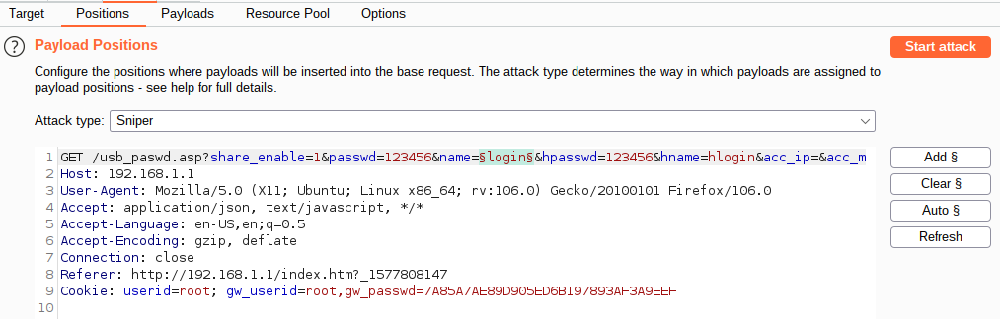
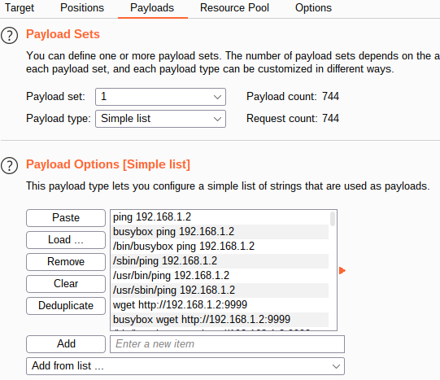

# 嵌入式设备web fuzz payplad

## 0x00

常见的嵌入式由于成本和开发便捷的缘故，一般都会采用剪裁后的Linux系统，这种系统一般自带的系统命令比较固定，如curl，wget，ping等，busybox为命令集

## 0x01

嵌入式设备存在命令注入或者缓冲区溢出漏洞，可以归类为对用户输入没有做限制

**命令注入漏洞：**用户提交的内容，没有经过正确处理，最终由system()或者popen()等函数执行，就会造成命令注入，如下图，用户提交的hostname参数经过一系列处理，最终会由popen()函数执行，






**缓冲区溢出漏洞：**用户提交的内容，没有经过长度判断，通过stycpy()等可对堆栈进行操作的函数执行，如果提交过长的内容，就有可能超过堆栈最大长度，导致缓冲区溢出。

如下图，获取的contype内容如果过长，就会导致缓冲区溢出



## 0x02

在拿到一个实体设备或者模拟了web服务后，我们一般会去点一点看web页面都有哪些功能，这时候可以通过burp抓包，进一步查看http包的内容和一些参数，可以对这些参数进行fuzz，payload预置一些命令注入的载荷和超长字符串。使用burp爆破模块选择爆破，可能效率不高，但作为前期，也是一件顺便的事。



## 0x03

嵌入式设备web fuzz的目的是为了发现命令注入和缓冲区溢出漏洞，不同于传统渗透测试，可以根据不同的目的选择判断标准，如爆破目录可根据状态码判断等

在此场景下，我们选取判断标准需要考虑到的情况有如下几种

①许多命令注入漏洞是没有回显的，那么就需要使用ping 命令或者wget与外部交互，可以用python起一个简单的web服务器或者wireshark抓包查看流量

②如果存在缓冲区溢出漏洞，那么在web fuzz过程中，造成的效果为拒绝服务，但是有特殊情况是只有造成部分组件拒绝服务，httpd服务会正常运行，此时外部监控异常状态就不是很好掌控

③fuzz需要速度，要是多线程同时fuzz多个接口或者form，则可能不是很好定位到底是哪个接口存在漏洞

**半自动fuzz：**（TODO）

将拦截的数据包发送到爆破选项卡，自动选择或者手动选择想要fuzz的参数，并将参数保存下来（添加新的插件）

批量导入payload，同时启动监控，开启httpd服务，wireshark抓包，流程后续需要优化






**全自动fuzz（爬虫+wfuzz等）**   （TODO）

爬虫爬取链接，发送到wfuzz自动加载payload进行测试，测试每一条url时加上时间戳


## 0x04

根据智能设备web漏洞的特点，测试命令注入漏洞的载荷有如下特点

1.没有回显，故采用ping wget 等命令，且有时需要的是绝对路径

2.需要截断符，需要编码等等，如

```
``   ;   换行  $(command)   %0A 
```

写了一个简单脚本，用于生成一些常见的payload

usage：

```
python generating_payload.py 192.168.1.2 9999
```

ip对应的是外部可以监控到的地址（本机）， 端口为本地启动的httpd服务器


## 0x05

当前缺点和后续要做的：

1、使用burp 的intruder模块显得比较笨重（想一键hhhh），自动化fuzz还没有想怎么做

2、监控机制还不完善，需要跟着载荷更新

3、随手点也是一个收集输入点的过程，开发一个burp插件，输入点可用于后续静态污点分析

4、看过国外一个文章是通过web  fuzz得到一个命令注入，监控的是串口输出日志得到

[Vulnerabilities in Tenda's W15Ev2 AC1200 Router (boschko.ca)](https://boschko.ca/tenda_ac1200_router/)


一个生成fuzz payload的burp插件

https://github.com/volkandindar/agartha


